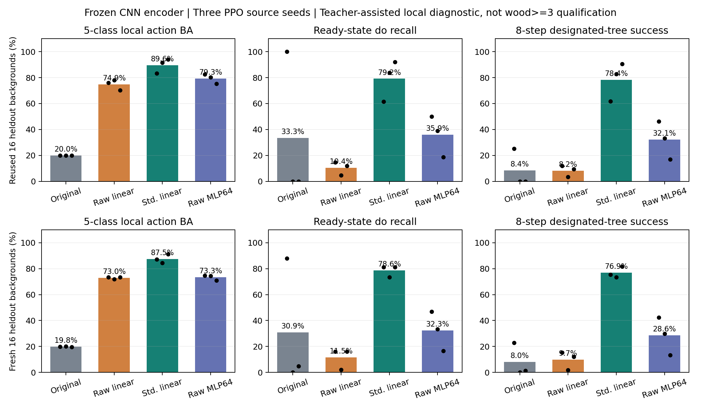
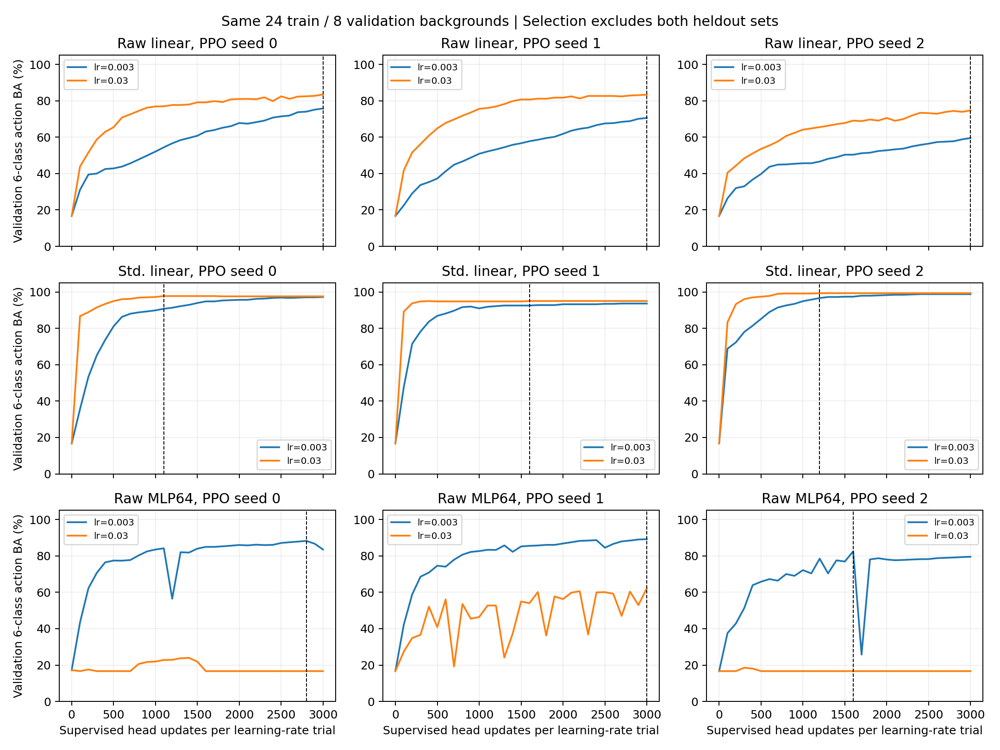
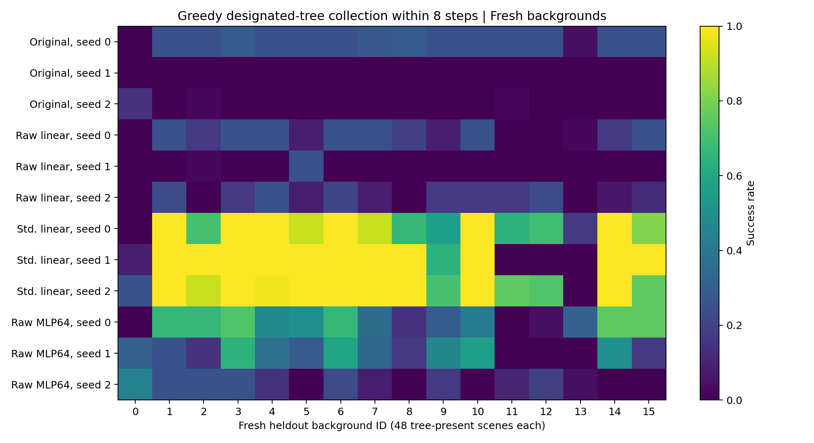

# Crafter actor 优化条件与容量诊断（2026-10-09）

本轮完成了原始特征线性 head、训练集标准化线性 head 和小型 MLP head 的
CUDA 对照，以及保存 head 在全新背景上的冻结评估。**相同的 128→17 仿射
结构，改用训练集均值/标准差进行监督拟合后，新背景的八步 greedy 指定树
采集率从 9.7% 提升到 76.9%。** 保持原始特征、扩大为 MLP 的结果为 28.6%。
这支持局部动作拟合存在优化条件问题，不能继续把低 do 召回当作已经证明的
线性结构缺陷，也不能据此声称原生 PPO 或完整 wood≥3 任务已经解决。

诊断仍使用 teacher-assisted Policy 副本。原 encoder、critic、PPO optimizer、
100k checkpoint、Crafter 安装包和 teacher-free baseline 均保持不变。离线监督
优化只发生在复制的 actor 上；未启动正式训练、未注册 Module、未更新
Knowledge/SPT。

## 协议与比较边界

使用已有 CNN-only seed0/1/2 的 100k checkpoint，并复用上一轮经过分组审计的
48 个背景：训练24、验证8、保留16。每背景60个场景，覆盖 wood0/1/2、四个
树方向和四个朝向的48个有树场景，以及12个无相邻树场景。输入始终是 RGB
及其冻结 CNN embedding；构造标签仅进入副本监督损失，oracle 不进入 Policy
输入。无相邻树的 noop 是 fixture 标签约定，不能解释成自然世界的探索策略。

| 变体 | 特征与初始化 | 评估时实际结构 | actor 参数数 |
| --- | --- | --- | ---: |
| Baseline | 原始特征、原 checkpoint | Linear(128,17) | 2193 |
| Raw linear | 原始特征、复制原 actor | Linear(128,17) | 2193 |
| Standardized linear | 仅训练背景均值/标准差；初始函数与原 actor 等价 | 折叠回 Linear(128,17) | 2193 |
| Raw MLP64 | 原始特征、固定新初始化 seed47000001 | Linear(128,64)→Tanh→Linear(64,17) | 9361 |

每个拟合变体均使用 Adam、学习率候选0.003/0.03、weight decay=0、每候选
3000次 full-batch 更新；类别权重仅由训练集计算。每100次更新，以验证集
六类 balanced accuracy 选模型，平分保留先出现者。两个保留集均不参与
normalizer 计算、梯度或模型选择。动作 mask 仍允许0..6，动作7..16被屏蔽；
两个线性变体的屏蔽行完全保留原值。MLP不具有相同的原线性参数行，不能
对它作这一声明；其评估仍遵守相同动作 mask。

标准化令 z=(x−μ)/σ。训练得到 Wz、bz 后，保存 Wx=Wz/σ、
bx=bz−Wxμ，因此推理仍直接接收原始 embedding。σ 下限为1e−4，三个 seed
均没有维度触发下限。训练特征标准差范围分别为0.00125–0.371、
0.00359–0.0572、0.00959–0.0817；中位数分别为0.0953、0.0252、0.0438。
标准化改变 Adam 所处的参数坐标、有效步长与偏置耦合，保持仿射函数类别。

复用保留集的 rollout 为每场景5次采样与1次 greedy；所有变体在本轮使用
相同场景和 action RNG manifest。该 manifest 与上一轮不同，故原始 baseline
也重新评估。输入 seed 相同不代表不同 Policy 的完整轨迹相同。指定起始相邻
树的采集才算成功，其他树的 wood 增量单独记录。

环境使用临时稳定排序 wrapper `balance-object-insertion-order-v1`，真实 CUDA
开启 deterministic algorithms，关闭 TF32/cudnn benchmark。背景来自原生
worldgen，中心3×3草地、固定白天、初始资源9、无其他实体；Player、转向、
移动和采集使用原生逻辑。走出中心仍可遇到其他天然材料或树。这是受控局部
任务，尚未覆盖自然任务的探索、敌人、生存和长轨迹。

## 复用保留背景的结果

以下以三个 source PPO seed 的均值报告；重复场景和背景不是额外独立 Policy seed。
五类 BA 只统计有树时的四方向动作和 do，模型选择使用的六类 BA 另含 noop。

| 指标 | Baseline | Raw linear | Standardized linear | Raw MLP64 |
| --- | ---: | ---: | ---: | ---: |
| 有树五类动作 BA | 20.0% | 74.9% | **89.6%** | 79.3% |
| 已对准时首步 do 召回 | 33.3% | 10.4% | **79.2%** | 35.9% |
| 未对准时首步正确方向率 | 16.7% | 91.0% | **92.2%** | 90.2% |
| 八步 greedy 指定树采集 | 8.4% | 8.2% | **78.4%** | 32.1% |
| 需转向场景八步 greedy 采集 | 0.1% | 7.5% | **78.0%** | 30.8% |

标准化线性 head 三个 seed 的训练集 do 召回均为100%，验证集为92.7%、
100%、100%；Raw linear 的训练集 do 召回仍为14.6%、1.7%、16.7%。标准化
线性 head 选择 lr=0.03，epoch 分别为1100、1600、1200；Raw linear 全部选
lr=0.03、epoch3000，与上一轮保存的 raw actor 权重和拟合历史完全相同。
MLP全部选择 lr=0.003，epoch2800、3000、1600。

复用保留集已在上一轮被查看，本轮问题与变体设计也受此前诊断启发，因此
不能将这部分包装成预注册的独立测试。随后增加的 fresh 评估用于检查保存
head 的背景迁移，所有变体完整报告，不根据 fresh 表现再次拟合或挑选 head。

## 全新背景的冻结确认

从 seed51000000开始，先排除此前两轮共96个可见背景签名，检查40个候选，
因旧背景重复排除24个，得到16个新背景、960图。接受顺序只由可见背景去重
决定，先于特征与 Policy 表现；新背景 seed、背景 RGB 签名和完整 RGB 均与
此前数据不重叠。新数据全部是 heldout，训练/验证数均为0。

fresh 协议在查看 paired 结果后固定，是顺序开展的确认性 pilot，并非事先
预注册的正式实验。保存的9个 head 全部重载，额外比较三个原始 baseline；
只运行 greedy，每场景最多8步。没有新监督拟合、PPO更新、normalizer更新
或模型选择。

| 新背景指标 | Baseline | Raw linear | Standardized linear | Raw MLP64 |
| --- | ---: | ---: | ---: | ---: |
| 有树五类动作 BA | 19.8% | 73.0% | **87.5%** | 73.3% |
| 已对准时首步 do 召回 | 30.9% | 11.5% | **78.6%** | 32.3% |
| 未对准时首步正确方向率 | 17.1% | 88.4% | **89.8%** | 83.6% |
| 八步 greedy 指定树采集 | 8.0% | 9.7% | **76.9%** | 28.6% |
| 需转向场景八步 greedy 采集 | 0.3% | 9.1% | **76.0%** | 27.3% |

| Source seed | Baseline 采集 | Raw linear 采集 | Standardized linear 采集 | Raw MLP64 采集 |
| --- | ---: | ---: | ---: | ---: |
| 0 | 22.79% | 15.36% | **75.52%** | 42.32% |
| 1 | 0.00% | 1.69% | **73.31%** | 29.95% |
| 2 | 1.17% | 12.11% | **81.77%** | 13.41% |

标准化的改善出现在三个 source seed 上，但18/48个“背景×seed”单元的
greedy 采集率低于0.8，最差为0。这里的0.8仅用于描述背景差异，**不是
20个完整资格 episode 的候选门槛评估**。例如新背景13的三个 seed 结果
分别为16.7%、0%、0%；背景1则全部100%。不能只看总体均值判断泛化稳定。

标准化线性 head 在2304个有树场景中成功1771、失败533。失败进一步分为：

| 失败类型 | 次数 |
| --- | ---: |
| 起始已对准，但首动作不是 do | 119 |
| 起始需转向，首动作方向错误 | 174 |
| 首步正确转向，但第二步不是 do，八步内仍未成功 | 240 |
| 首步/第二步按上述目标执行，八步内仍失败 | 0 |

240/533（45.0%）的剩余失败发生在正确转向之后，说明只提高方向分类不能
解决执行链。短轨迹未出现死亡或 health 损失；标准化 head 有树轨迹仍记录
11次其他树木材增量，均未算作指定目标成功。背景材料、特征偏移与动作错误
之间目前只是待检验的关联，尚未做单因素背景替换来确定原因。

## 结论与限制

1. **局部监督拟合的优化条件是有证据支持的瓶颈。** 同一个冻结 encoder、
   相同 actor 函数类别和监督预算，标准化使训练 do 拟合和新背景执行同时改善。
   原线性 head 可以表达显著更好的局部转向/采集行为；原始特征 head 的低 do
   召回不能证明线性不可分或必然缺少记忆。
2. **不是完整的容量因果对照。** MLP改变容量、初始化和非凸优化；本轮只用
   一个MLP初始化，没有 standardized MLP 的2×2对照。不能据结果断言 MLP
   架构不好，或排除其他容量方案的价值。
3. **监督拟合证据不能唯一解释原 PPO。** 本轮没有改变 PPO奖励、优势、
   value或探索分布；标准化在冻结标签任务中的收益，不等于自然 PPO 采用
   normalization 后必然改善。原始特征 head 也未被证明充分收敛。
4. **局部成功尚不等于 Module 资格。** 每场景最多采一棵起始相邻树，wood0/1/2
   是起始条件；没有重新做从自然 reset 达到 wood≥3 的独立资格评估，也未
   重验 stone/coal/pickaxe、Module完整契约、生存或连续任务链。

## 验证、产物与计算量

全量测试 **224 passed**。本轮新增7项测试覆盖标准化仅使用训练值、仿射
折叠、原 Policy/optimizer 隔离、MLP的CPU初始化 RNG 隔离、保存 head 重载、
保留数据不影响选择，以及 fresh 协议禁止拟合/旧seed/变体删减。

paired 独立进程重复 seed0 的三种完整拟合、baseline和三种 head 的所有
rollout；选模、历史、head状态、动作指标和完整轨迹完全一致。fresh 另一个
独立进程重复背景生成、冻结特征和seed0全部四种Policy的评估，完全一致。
每个被评估Policy还检查oracle observer开启/关闭的轨迹一致。

分析从JSONL重算指标并完成378项核验；CPU重载全部9个head完成147项核验，
从RGB重新提取原encoder特征、校验训练均值/标准差、验证选择规则、复算
训练/验证/两套保留指标，并证明encoder、critic和原optimizer未变。CPU/CUDA
概率与loss容差为3e−4，混淆矩阵相同。标准化仿射折叠存在float32舍入；
从保存head反推标准化坐标时，最大logit差约0.00365、0.000936、0.000570，
未改变审计中的分类结果；不声称浮点逐位相同。

fresh 开始前封存48个输入路径，并核对上一轮封存的29个源文件/checkpoint/
安装包路径仍未变化。**本轮新拟合源码是在拟合完成后、fresh开始前封存**，
不是拟合前的完整provenance。源码快照、配置、head和结果均保留，不能倒填
不存在的预先封存证据。

新artifact是head状态和监督元数据，未保存可恢复的新PPO optimizer/RNG；
不可作为可续训PPO checkpoint。安装head副本时保留原optimizer状态仅用于
冻结审计，尤其MLP不能直接使用旧optimizer续训。不得替换teacher-free基线。

| 成功完成的诊断计算量 | paired主实验 | paired独立重复 | fresh主评估 | fresh独立重复 |
| --- | ---: | ---: | ---: | ---: |
| 离线监督optimizer更新 | 54000 | 18000 | 0 | 0 |
| 诊断短轨迹 | 69120 | 23040 | 11520 | 3840 |
| 短轨迹交互步 | 400692 | 132587 | 74314 | 23104 |
| observer额外控制步 | 52 | 20 | 82 | 32 |
| 原生fixture校验步 | 0（复用） | 0（复用） | 32 | 32 |
| PPO训练交互步 | 0 | 0 | 0 | 0 |

首次启动曾因缺失_state_equal导入在baseline评估后、拟合前失败，修正后完整
重跑；该失败尝试未保留交互计数，上表只统计成功完成且有产物的主运行与
独立重复，不声称是所有尝试的总GPU/交互成本。原Policy未在失败尝试中更新。
本轮进程均已退出，GPU1空闲；代码/配置/文档仍是工作区修改，未创建新提交。

## 下一步

下一项优先诊断**背景泛化与自然状态迁移**，保留原Policy与保存的标准化线性
副本，不按本轮最差背景重新调参。先用独立背景做固定前景的背景替换对照，
报告“正确转向后仍不do”的错误；再在新自然reset种子上做冻结rollout，区分
可采机会下的动作执行、无相邻树时的停滞/探索、重复采集和生存退化，尤其
检查fixture的noop标签会否导致自然任务不探索。保持RGB输入，不用oracle选动作。

通过这一迁移诊断后，再决定有限预算的PPO优化条件对照是否有意义：固定
交互步、环境wrapper、奖励与动作集，单独改变经明确设计的特征/actor优化
方案，避免监督副本当成teacher-free PPO改进。完整wood≥3与Module契约资格
仍是后续独立关口，当前尚不进入正式持续学习实验。

## 入口与复现

- [paired配置](../configs/crafter_wood3_actor_head_ablation_cuda_v1.yaml)、[fresh配置](../configs/crafter_wood3_actor_head_fresh_cuda_v1.yaml)
- [head拟合实现](../experiments/crafter_actor_head_ablation.py)、[paired运行器](../experiments/run_crafter_wood3_actor_head_ablation.py)、[fresh运行器](../experiments/run_crafter_wood3_actor_head_fresh.py)
- [结果分析](../experiments/analyze_crafter_wood3_actor_head_conditioning.py)、[权重审计](../experiments/verify_crafter_wood3_actor_head_conditioning.py)、[失败归因](../experiments/analyze_crafter_actor_head_failures.py)
- [paired结果](../results/crafter_wood3_actor_head_ablation_cuda_20261009_v1/summary.json)、[fresh结果](../results/crafter_wood3_actor_head_fresh_cuda_20261009_v1/summary.json)
- [聚合指标与计数](../results/crafter_wood3_actor_head_ablation_cuda_20261009_v1/analysis/aggregate.json)、[逐轨迹核验](../results/crafter_wood3_actor_head_ablation_cuda_20261009_v1/analysis/verification.json)
- [head重载核验](../results/crafter_wood3_actor_head_ablation_cuda_20261009_v1/saved_head_verification.json)、[失败归因结果](../results/crafter_wood3_actor_head_ablation_cuda_20261009_v1/analysis/fresh_failure_attribution.json)







```bash
PYTHONHASHSEED=0 CUBLAS_WORKSPACE_CONFIG=:4096:8 OMP_NUM_THREADS=1 \
MKL_NUM_THREADS=1 CUDA_VISIBLE_DEVICES=1 \
/home/zl202621/.conda/envs/kecrl/bin/python -u \
  -m experiments.run_crafter_wood3_actor_head_ablation \
  --config configs/crafter_wood3_actor_head_ablation_cuda_v1.yaml \
  --output results/crafter_wood3_actor_head_ablation_cuda_NEW

# fresh配置的head_result_root须指向刚完成的paired结果。
PYTHONHASHSEED=0 CUBLAS_WORKSPACE_CONFIG=:4096:8 OMP_NUM_THREADS=1 \
MKL_NUM_THREADS=1 CUDA_VISIBLE_DEVICES=1 \
/home/zl202621/.conda/envs/kecrl/bin/python -u \
  -m experiments.run_crafter_wood3_actor_head_fresh \
  --config configs/crafter_wood3_actor_head_fresh_cuda_v1.yaml \
  --output results/crafter_wood3_actor_head_fresh_cuda_NEW

/opt/anaconda3/bin/python -m experiments.analyze_crafter_wood3_actor_head_conditioning \
  --paired results/crafter_wood3_actor_head_ablation_cuda_20261009_v1 \
  --fresh results/crafter_wood3_actor_head_fresh_cuda_20261009_v1 \
  --output results/crafter_wood3_actor_head_ablation_cuda_20261009_v1/analysis_NEW

OMP_NUM_THREADS=1 MKL_NUM_THREADS=1 \
/home/zl202621/.conda/envs/kecrl/bin/python -m experiments.verify_crafter_wood3_actor_head_conditioning \
  --paired results/crafter_wood3_actor_head_ablation_cuda_20261009_v1 \
  --fresh results/crafter_wood3_actor_head_fresh_cuda_20261009_v1 \
  --output results/crafter_wood3_actor_head_ablation_cuda_20261009_v1/saved_head_verification_NEW.json

/opt/anaconda3/bin/python -m experiments.analyze_crafter_actor_head_failures \
  --fresh results/crafter_wood3_actor_head_fresh_cuda_20261009_v1 \
  --output results/crafter_wood3_actor_head_ablation_cuda_20261009_v1/analysis_NEW
```
